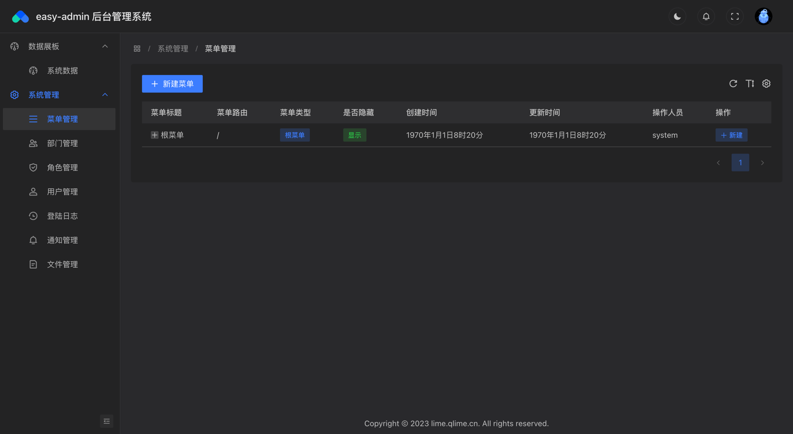

#### 快速预览
##### 常规主题
使用字节 [arco中后台最佳实践](https://arco.design/vue/docs/theme)框架进行开发

##### 夜间主题
使用字节强的色系算法，能够完整的在常规主题兼容夜间主题色。

#### 技术介绍
easy-admin 前端是使用vue3+typescript，后端使用gin+gorm+mysql+redis进行实现

#### 功能介绍
easy-admin 目前实现了完整的后台权限管理、菜单管理、部门管理等功能。开箱即用，项目清晰，无论是二开还是直接使用，都是不错的选择。

#### 免费商用
easy-admin 再次承诺，此框架将永久免费商用，纯爱发电～～
