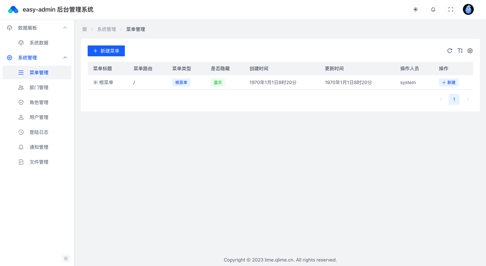
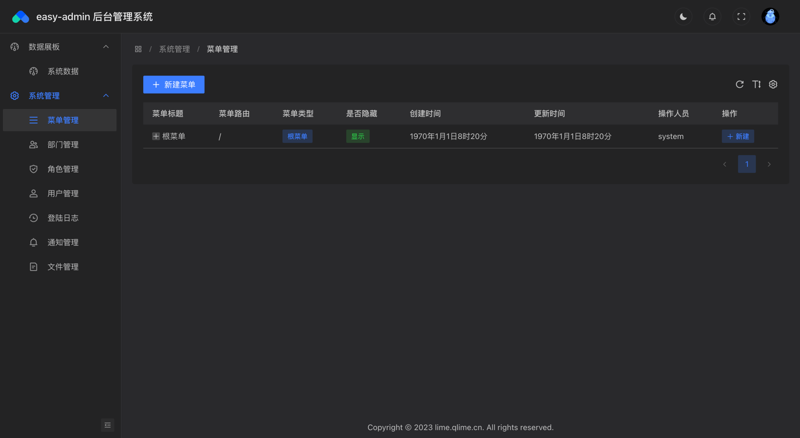

### easy-admin 快速上手的go+vue3的后台管理系统


### 技术架构
- 前端：vue3+vite+ts
- 后端：gin+mysql+redis

### 技术特性
- 自动初始化：系统启动即可完整数据初始化，无须额外配置导入。
- rbac角色权限校验+自定义指令：通过rbac实现后端接口权限控制，通过自定义指令实现对应前端界面控制。
- 全局可配置：网站logo、名称、证书、邮箱模板...全部配置化，仅仅改一下配置，即可实时生效。
- 静态资源分离：网站对静态资源进行统一管理，提供统一的调用方式，仅变更配置就可以变更对应的存储介质，目前支持阿里云、腾讯云、七牛云、华为云、本地存储等
- 全局限流：实现全局的流量限制，避免流量太大造成服务器压力，仅配置就可以开启。
- ip限流：实现指定用户的的流量限制，避免用户恶意请求，流量太大造成服务器压力，仅配置就可以开启。
- 自适应降载：系统实现对自身cpu以及内存的检测，导致指定的阈值就可以触发限流，仅配置就可以开启。
- 链路日志：可以通过链路id完整记录请求记录，包括请求出入参、耗时、sql执行情况等，兼容k8s以及单服务器，并且可以进行日志切片等。
- pprof分析工具：可以通过配置就可以开启pprof分析工具，实现网站的指标分析。

### 界面预览
##### 日间主题预览图
采用字节最新开源中后台最佳实践项目进行开发，在ui设计风格上保持字节系ui风格，具有完整的免费的强大的生态社区，配套的风格配置、物料平台也是非常好用。

##### 夜间主题预览图
强大的色彩算法，能够进行在日间主题的色彩上进行无缝切换到日间主题，能够进行网站颜色搭配的自动转变。


### 启动命令
无须导入sql，启动全流程初始化数据。
```
#后端启动
go run main.go -c config-dev.yaml

#前端启动
yarn dev 
```

### 预览网站
http://demo.qlime.cn/

账号：18888888888
密码：123456

### 在线文档

[easy-admin在线开发文档](http://wiki-demo.qlime.cn/)
